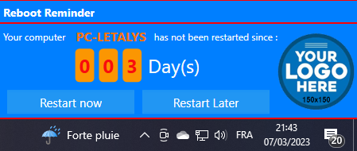

# Powershell : SCCM Create a Reboot Reminder

These scripts allow through SCCM compliance rules to display an interface (Notification) in XAML in order to display the number of days since the last restart of the user's computer and to offer to restart it.



## Scripts Configuration

### Configure the compliance detection script

You can modify the maximum threshold for the number of days between two restarts (Line 16). Beyond this value ,if the number of days since last restart reaches or exceeds this value, then the remediation script will be executed. The value returned by the script will be ``$true`` (considered non-compliant)

```
$MaxDays = 7
```

I setup 7 days by default

### Path to your UI Files (XML and Logo)

Compliance rules will be executed with the credentials of the logged in user. Therefore, you must place the XML and Logo files in a share that is readable by all your users. For example, you can use the **SYSVOL** share of your domain controller. For me, that's how I use it.

### Configure the XAML UI for your Logo

Now you can add the path to your logo via an absolute path (Which then points to your shared read space).
In UI XML file, setup the source image (150x150) (line 80). You can use UNC path.

```
<Image Source="<YourSharedPath>" Grid.Row="1" Grid.Column="1" Grid.RowSpan="3" HorizontalAlignment="Stretch" Margin="0,0,3,0"/>
```

### Configure the compliance remediation script

Now you need to configure the remediation script. (line 85 to 88)

```
#Configuration
$XAMLUrl = "<YourSharedPath>\RebootReminder.UI.xml"
$ErrLogUI = "$env:USERPROFILE\CCM-RebootReminder-Runspace.log"
$ErrLogExec = "$env:USERPROFILE\CCM-RebootReminder-MainExec.log"
```

For Error log, user need to have write access, so i use ``$env:USERPROFILE`` but you can change it.

## SCCM Compliance rules configuration

### Creating new configuration item

### Creating new baseline configuration

### Deploying


## 🔗 Links
https://github.com/Letalys/Powershell-SCCM-CustomInventory


## Autor
- [@Letalys (GitHUb)](https://www.github.com/Letalys)