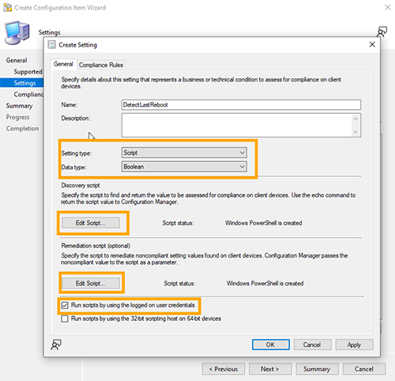
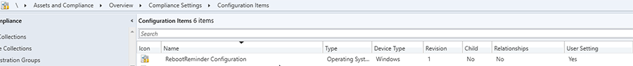

# Powershell : SCCM Create a Reboot Reminder

These scripts allow through SCCM compliance rules to display an interface (Notification) in XAML in order to display the number of days since the last restart of the user's computer and to offer to restart it.


## Scripts Configuration

### Configure the compliance detection script

You can modify the maximum threshold for the number of days between two restarts (Line 16). Beyond this value ,if the number of days since last restart reaches or exceeds this value, then the remediation script will be executed. The value returned by the script will be ``$true`` (considered non-compliant)

```
$MaxDays = 7
```

I setup 7 days by default

### Path to your UI Files (XML and Logo)

Compliance rules will be executed with the credentials of the logged in user. Therefore, you must place the XML and Logo files in a share that is readable by all your users. For example, you can use the **SYSVOL** share of your domain controller. For me, that's how I use it.


>***You can also decide to integrate the XAML code directly into the remediation script, but I prefer to split the two to facilitate maintenance. However you will still need to put your logo in a shared space accessible to all in reading (unless you remove the image tag to put nothing)***

### Configure the XAML UI for your Logo

Now you can add the path to your logo via an absolute path (Which then points to your shared read space).
In UI XML file, setup the source image (150x150) (line 80). You can use UNC path.

```
<Image Source="<YourSharedPath>" Grid.Row="1" Grid.Column="1" Grid.RowSpan="3" HorizontalAlignment="Stretch" Margin="0,0,3,0"/>
```

### Configure the compliance remediation script

Now you need to configure the remediation script. (line 85 to 88)

```
#Configuration
$XAMLUrl = "<YourSharedPath>\RebootReminder.UI.xml"
$ErrLogUI = "$env:USERPROFILE\CCM-RebootReminder-Runspace.log"
$ErrLogExec = "$env:USERPROFILE\CCM-RebootReminder-MainExec.log"
```

For Error log, user need to have write access, so i use ``$env:USERPROFILE`` but you can change it.

## SCCM Compliance rules configuration

### Creating new configuration item

In the SCCM console : **Assets and Compliance/Overview/Compliance Settings/Configuration Items** , create new configuration item.

Set the item configuration name.


Select the supported platform of your script. In this case, we select Windows 7 x64 and Windows 10 x64.


In Settings Tabs, add New setting. 

#### General Tabs

Select **script** for setting type and **boolean** for datatype. (It's the return value type for the detection script).

In **Discovery script**, copy/paste the detection script.
In **Remediation script**, copy/paste the remediation script.

Check **Run scripts by using the logged on user credentials**



#### Compliance rules Tabs

Add new rule.
Set the name of your rule and set **the value returned by the specific script Equals True**

Check **Run the specified remediation script when this setting is noncompliant**


You can go to finalize the Create configuration Wizard.

 


### Creating new baseline configuration

In the SCCM console : **Assets and Compliance/Overview/Compliance Settings/Configuration Baselines**, create new configuration baseline.

Add Configuration data and select your Configuration Item


### Deploying your configuration baseline

You can right click on your baseline and select **Deploy**

Check **Remediate noncompliant rules when supported**
Select the collection you want to deploy your baseline.

Schedule your evaluation.

> I set every 4 hours because if a user click on restart later, it will be prompt again 4H later.
> But you can schedule your compliance evaluation as you wish


## 🔗 Links
https://github.com/Letalys/Powershell-SCCM-RebootReminder


## Autor
- [@Letalys (GitHUb)](https://www.github.com/Letalys)